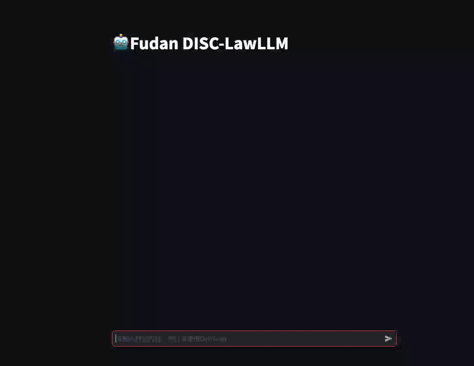

<div align="center">

[ZH](./README.md) | EN

<h1>DISC-LawLLM</h1>
  
[](https://huggingface.co/ShengbinYue/DISC-LawLLM)
[](./LICENSE)

[Demo](https://law.fudan-disc.com) | [Technical Report](https://arxiv.org/abs/2309.11325)

</div>

DISC-LawLLM is a large language model specialized in Chinese legal domain, developed and open-sourced by [Fudan University Data Intelligence and Social Computing Lab (Fudan-DISC)](http://fudan-disc.com) , to provide comprehensive intelligent legal services.

We will open-source the following resources in this project:
* [DISC-Law-SFT dataset](https://huggingface.co/datasets/ShengbinYue/DISC-Law-SFT) (excluding Q&A data)
* [DISC-LawLLM model weights](https://huggingface.co/ShengbinYue/DISC-LawLLM)
* DISC-Law-Eval Benchmark (to be released soon)

You can experience our DISC-LawLLM [online](https://law.fudan-disc.com).

## News

**[2023/09/25]** DISC-LawLLM v1.0 has been officially released, with the [DISC-LawLLM-13B model weights](https://huggingface.co/ShengbinYue/DISC-LawLLM) and the [DISC-Law-SFT dataset](https://huggingface.co/datasets/ShengbinYue/DISC-Law-SFT) made open source.

## Table of Contents

- [Overview](#overview)
- [Inference and Deployment](#inference-and-deployment)
- [Model Fine-tuning](#model-fine-tuning)
- [DISC-Law-Eval Benchmark](#disc-law-eval-benchmark)
- [Acknowledgements](#acknowledgements)
- [Disclaimer](#disclaimer)
- [Citation](#citation)
- [License](#license)


## Overview


<p></p>

DISC-LawLLM is a large language model designed to provide professional, intelligent, and comprehensive legal services. It caters to different user groups and offers assistance in various scenarios, with the following main features:

* **Legal text processing abilities:** DISC-LawLLM is capable of comprehending legal knowledge and generating based on legal text. Its main functionalities include information extraction, text summarization, etc. which have been fine-tuned using publicly available NLP datasets related to Chinese legal tasks and real-world legal texts.
* **Legal reasoning abilities:** To meet the requirements of tasks in smart legal services, DISC-LawLLM possesses specialized legal reasoning techniques. It leverages the concept of legal syllogism, a theory of legal reasoning, to effectively enhance its reasoning capabilities in Chinese legal domain.
* **Compliance with Chinese legal domain knowledge:** DISC-LawLLM is augmented with a retrieval module, strengthening the its ability to retrieve, comprehend, and adhere to background Chinese legal knowledge.

In addition to these features, we have made the following contributions during our research behind DISC-LawLLM:

* **High-Quality training datasets and universally effective training paradigms**
* **Comprehensive Chinese legal model evaluation framework and evaluation datasets**

### Demonstration

#### Legal consultation


#### Agreement writing


#### Professional judicial tools


#### Examination Assistant


#### Law retrieval


#### Legal consultation with retrieval module



### DISC-Law-SFT Dataset

Intelligent applications in Chinese legal domain under different scenarios often require a combination of various abilities, including legal text understanding and generation. To achieve this, we have constructed a high-quality supervised fine-tuning dataset called DISC-Law-SFT. This dataset covers different judicial application scenarios and includes a wide variety of tasks such as legal information extraction, legal judgment prediction, legal document summarization, and legal question answering. DISC-Law-SFT comprises two subsets, DISC-Law-SFT-Pair and DISC-Law-SFT-Triplet. The former aims to introduce legal reasoning abilities to the LLM, while the latter helps enhance the model's capability to utilize external legal knowledge. For more detailed information, please refer to our [technical report](https://arxiv.org/abs/2309.11325). The distribution of the dataset is as follows:


<table>
  <tr>
    <th>Dataset</th>
    <th>Task/Source</th>
    <th>Size</th>
    <th>Scenario</th>
  </tr>
  <tr>
    <td rowspan="10">DISC-Law-SFT-Pair</td>
    <td>Legal information extraction</td>
    <td>32K</td>
    <td rowspan="7">Legal professional assistant</td>
  </tr>
  <tr>
    <td>Legal event detection</td>
    <td>27K</td>
  </tr>
  <tr>
    <td>Legal case classification</td>
    <td>20K</td>
  </tr>
  <tr>
    <td>Legal judgement prediction</td>
    <td>11K</td>
  </tr>
  <tr>
    <td>Legal case matching</td>
    <td>8K</td>
  </tr>
  <tr>
    <td>Legal text summarization</td>
    <td>9K</td>
  </tr>
  <tr>
    <td>Judicial public opinion summarization</td>
    <td>6K</td>
  </tr>
  <tr>
    <td>Legal question answering</td>
    <td>93K</td>
    <td>Legal consultation services</td>
  </tr>
  <tr>
    <td>Legal reading comprehension</td>
    <td>38K</td>
    <td rowspan="2">Judicial examination assistant</td>
  </tr>
  <tr>
    <td>Judicial examination</td>
    <td>12K</td>
  </tr>
  <tr>
    <td rowspan="2">DISC-Law-SFT-Triplet</td>
    <td>Legal judgement prediction</td>
    <td>16K</td>
    <td>Legal professional assistant</td>
  </tr>
  <tr>
    <td>Legal question answering</td>
    <td>23K</td>
    <td>Legal consultation services</td>
  </tr>
  <tr>
    <td rowspan="2">General</td>
    <td>Alpaca-GPT4</td>
    <td>48K</td>
    <td rowspan="2">General scenarios</td>
  </tr>
  <tr>
    <td>Firefly</td>
    <td>60K</td>
  </tr>
  <tr>
    <td>Total</td>
    <td colspan="3">403K</td>
  </tr>
</table>


We have released a total of nearly 300K training data, including both DISC-Law-SFT-Pair and DISC-Law-SFT-Triplet datasets. They are currently available from this [link](https://huggingface.co/datasets/ShengbinYue/DISC-Law-SFT).

## Retrieval Module

On the basis of DISC-LawLLM, we have augmented it with a retrieval module based on the open-source retrieval framework [Langchain-Chatchat](https://github.com/chatchat-space/Langchain-Chatchat). Our knowledge base currently includes repositories of legal provisions, judicial documents, judicial examinations.

* The repository of legal provisions and judicial documents includes over 800 national and local Chinese laws, regulations, and provisions. It covers *Constitution*, *Criminal Law*, *Administrative Procedure*, *Labor Law*, *Copyright Law*, *Civil Code*, *Patent Law*, *Law on the Exclusive Economic Zone and the Continental Shelf*, *Measures for the Election of Deputies from the Chinese People's Liberation Army to the National People's Congress and Local People's Congresses at or above the County Level*, *Anti-Secession Law*, *Regulation on the Administration of the Entry and Exit of Foreign Nationals*, *Provisions of State Council for Encouraging Taiwan Compatriots to Invest*, *Provisions on the Administration of Religious Activities of Aliens Within the Territory*, and more.
* The repository for judicial examinations includes 24K problems related to Chinese legal knowledge.

In the future, we will continuously expand the knowledge base of our retrieval module. Furthermore, we will continue to explore and enhance the retrieval system of DISC-LawLLM. This may include, but is not limited to, mechanisms for joint training of the retrieval module and the LLM. If you are interested, we welcome further discussions and collaboration in this regard.

## Inference and Deployment

The open-source DISC-LawLLM is fine-tuned based on [Baichuan-13B-Base](https://github.com/baichuan-inc/Baichuan-13B). Our model weights can be downloaded directly from [Hugging Face](https://huggingface.co/ShengbinYue/DISC-LawLLM), or obtained automatically from the example code below. First of all, please install the dependencies required for this project:

```
pip install -r requirements.txt
```

### Python

```python
import torch
from transformers import AutoModelForCausalLM, AutoTokenizer
from transformers.generation.utils import GenerationConfig

model_path = "ShengbinYue/DISC-LawLLM"
model = AutoModelForCausalLM.from_pretrained(
    model_path, torch_dtype=torch.float16, device_map="auto", trust_remote_code=True
)
model.generation_config = GenerationConfig.from_pretrained(model_path)
tokenizer = AutoTokenizer.from_pretrained(
    model_path, use_fast=False, trust_remote_code=True,
)

messages = [
    {"role": "user", "content": "生产销售假冒伪劣商品罪如何判刑？"},
]
response = model.chat(tokenizer, messages)
```

### Command Line Tool

```
python cli_demo.py
```

### Web Demo

Based on streamlit, the following command will start a web server. The console will output an address, which can be visited by entering in the browser:

```
streamlit run web_demo.py --server.port 8888
```

### Deployment

The current version of DISC-LawLLM is fine-tuned based on the Baichuan-13B model, so you can refer to [Baichuan-13B](https://github.com/baichuan-inc/Baichuan-13B) documentation for information on deploying int8 or int4 quantized inference and CPU deployment.

## Model Fine-Tuning

Developers can fine-tune DISC-LawLLM for specialized use. To do this, you can refer to [LLaMA Efficient Tuning](https://github.com/hiyouga/LLaMA-Efficient-Tuning) or our [DISC-MedLLM](https://github.com/FudanDISC/DISC-MedLLM) medical model, which are compatible with DISC-LawLLM for fine-tuning. Here we will take [LLaMA Efficient Tuning](https://github.com/hiyouga/LLaMA-Efficient-Tuning) as an example, and provide reference scripts for both **full** and **LoRA** fine-tuning.

First, download [LLaMA Efficient Tuning](https://github.com/hiyouga/LLaMA-Efficient-Tuning) and follow its [instructions](https://github.com/hiyouga/LLaMA-Efficient-Tuning#getting-started) to install the required dependencies. Note that the training data should be processed in the format specified by the project. The example scripts will be given as follows.

### Full Fine-Tuning

We have tested full fine-tuning under the setting of 8 * Nvidia A800 80 GB + deepspeed. The script is as follows:

```
deepspeed --num_gpus=8 src/train_bash.py \
    --stage sft \
    --model_name_or_path S heng bin \
    --do_train \
    --dataset alpaca_gpt4_zh \
    --template baichuan \
    --finetuning_type full \
    --output_dir path_to_your_sft_checkpoint \
    --overwrite_cache \
    --per_device_train_batch_size 4 \ 
    --per_device_eval_batch_size 4 \ 
    --gradient_accumulation_steps 8 \ 
    --preprocessing_num_workers 8 \
    --lr_scheduler_type cosine \
    --logging_steps 10 \
    --save_steps 100 \
    --eval_steps 100 \
    --learning_rate 5e-5 \
    --max_grad_norm 0.5 \
    --num_train_epochs 2.0 \
    --dev_ratio 0.01 \
    --evaluation_strategy steps \
    --load_best_model_at_end \
    --plot_loss \
    --fp16 \
    --deepspeed deepspeed.json
```

`deep_speed.json` configuration is as follows:

```json
{
    "train_micro_batch_size_per_gpu": "auto",
    "zero_allow_untested_optimizer": true,
    "fp16": {
        "enabled": "auto",
        "loss_scale": 0,
        "initial_scale_power": 16, 
        "loss_scale_window": 1000,
        "hysteresis": 2,
        "min_loss_scale": 1
    },  
    "zero_optimization": {
        "stage": 2,
        "allgather_partitions": true,
        "allgather_bucket_size": 5e8,
        "overlap_comm": false,
        "reduce_scatter": true,
        "reduce_bucket_size": 5e8,
        "contiguous_gradients" : true
    }
}
```

## LoRA Fine-Tuning

We tested LoRA fine-tuning under the setting of 4 * Nvidia A800 80G GPUs. The scripts is as follows:

```
torchrun --nproc_per_node 4 src/train_bash.py \
    --stage sft \
    --model_name_or_path ShengbinYue/DISC-LawLLM \
    --do_train \
    --dataset alpaca_gpt4_zh \
    --template baichuan \
    --finetuning_type lora \
    --lora_rank 8 \ 
    --lora_target W_pack \
    --output_dir path_to_your_sft_checkpoint \
    --overwrite_cache \
    --per_device_train_batch_size 4 \ 
    --per_device_eval_batch_size 4 \ 
    --gradient_accumulation_steps 8 \ 
    --preprocessing_num_workers 16 \
    --lr_scheduler_type cosine \
    --logging_steps 10 \
    --save_steps 100 \
    --eval_steps 100 \
    --learning_rate 1e-5 \
    --max_grad_norm 0.5 \
    --num_train_epochs 2.0 \
    --dev_ratio 0.01 \
    --evaluation_strategy steps \
    --load_best_model_at_end \
    --plot_loss \
    --fp16
```

## DISC-Law-Eval-Benchmark

Inspired by the composition of judicial examinations, we developed a fair and comprehensive evaluation framework called DISC-Law-Eval Benchmark. This framework assesses the performance of LLMs in Chinese legal domain from both objective and subjective perspectives. Our DISC-Law-Eval Benchmark is available through this [link](./eval) (to be released soon).

### Objective Evaluation

*Note: Throughout this project, we will use the term "single-choice question" to represent "multiple choice question with single correct option", and the term "multiple-choice question" to represent only "multiple-choice question with more than one correct options".*

In order to objectively and quantitatively evaluate Chinese legal knowledge and reasoning abilities of LLMs in Chinese legal domain, the objective evaluation dataset consists of a series of single-choice and multiple-choice questions from standardized Chinese judicial examinations and legal knowledge competitions. These questions are categorized into three levels of difficulty: hard, medium, and easy, based on contextual and deductive complexity. This dataset provides a more challenging and reliable way to measure whether a model can utilize its knowledge in Chinese legal domain to deduce correct answers. Performance is demonstrated through accuracy computations. Details are revealed as follows:

<table>
  <tr>
    <th>Subject</th>
    <th>Difficulty</th>
    <th>Size (Single Choice)</th>
    <th>Size (Multiple Choice)</th>
    <th>Size (Total)</th>
  </tr>
  <tr>
    <td>NJE: China's Unified Qualification Exam for Legal Professionals </td>
    <td rowspan="3">Hard</td>
    <td>537</td>
    <td>463</td>
    <td>1000</td>
  </tr>
  <tr>
    <td>PAE: Qualification Exam of Patent Attorney</td>
    <td>118</td>
    <td>276</td>
    <td>394</td>
  </tr>
  <tr>
    <td>CPA: Qualification Exam of Certified Public Accountant</td>
    <td>197</td>
    <td>120</td>
    <td>317</td>
  </tr>
  <tr>
    <td>UNGEE: China's Unified Entrance Examination for Master of Laws</td>
    <td>Medium</td>
    <td>320</td>
    <td>87</td>
    <td>407</td>
  </tr>
  <tr>
    <td>LBK: Repository of Fundamental Chinese Legal Knowledge</td>
    <td rowspan="2">Easy</td>
    <td>275</td>
    <td>-</td>
    <td>275</td>
  </tr>
  <tr>
    <td>PFE: Legal Examination for Public Service</td>
    <td>170</td>
    <td>-</td>
    <td>170</td>
  </tr>
</table>

### Subjective Evaluation

For subjective evaluation, we assess the LLMs in the question-answering format to simulate the process of subjective examination. We have manually constructed a high-quality test set by sourcing data from legal consultations, online forums, judicial-related publications, and Chinese judicial documents. We use GPT-3.5 Turbo as the referee model to evaluate the model's outputs and provide scores ranging from 1 to 5 based on three criteria: accuracy, completeness, and clarity with respect to standard answers.

The subjective question dataset is a high-quality test set comprising 300 examples. It covers various scenarios, including legal knowledge Q&A, legal consultations, and legal judgment predictions. These examples are manually curated from legal consultations, online posts, judicial-related publications, and legal documents.

### Evaluation Results

We applied the few-shot approach for objective evaluation. The following results represent the accuracy (%) of the models on objective questions. S stands for single-choice questions, and M stands for multiple-choice questions.

|        Model        |  NJE (S)  |  NJE (M)   |  PAE (S)   |  PAE (M)   |  CPA (S)  |  CPA (M)   | UNGEE (S)  | UNGEE (M)  |  PFE (S)   |  LBK (S)   |   Average   |
|:----------------:|:---------:|:---------:|:---------:|:---------:|:---------:|:---------:|:---------:|:---------:|:---------:|:---------:|:---------:|
|     ChatGLM      |   31.66   |   1.08    |   27.97   |   2.90    |   37.06   |   13.33   |   39.69   |   20.69   |   37.65   |   42.91   |   24.66   |
|  Baichuan-Chat   |   31.47   |   10.15   |   29.66   |   8.70    |   35.53   |   19.17   |   50.00   |   27.59   |   53.12   |   53.45   |   30.78   |
| Chinese-Alpaca-2 |   25.70   |   10.15   |   30.51   |   11.59   |   32.99   |   19.17   |   40.94   |   21.84   |   44.12   |   43.27   |   26.73   |
|  GPT-3.5-turbo   |   36.50   |   10.58   |   37.29   |   17.03   | **42.13** | **21.67** | **51.25** | **28.74** |   53.53   |   54.18   |   34.10   |
|     LexiLaw      |   20.11   |   7.56    |   23.73   |   10.14   |   24.87   |   19.17   |   31.56   |   16.09   |   31.76   |   40.36   |   21.50   |
|      LawGPT      |   22.91   |   6.26    |   31.36   |   7.61    |   25.38   |   16.67   |   30.31   |   13.79   |   34.71   |   29.09   |   20.60   |
|   Lawyer LLaMa   |   35.75   |   5.62    |   32.20   |   6.52    |   29.95   |   13.33   |   32.50   |   14.94   |   39.41   |   39.64   |   25.05   |
|     ChatLaw      |   27.56   |   7.99    |   31.36   |   9.42    |   35.53   |   11.67   |   35.62   |   17.24   |   42.35   |   41.09   |   25.20   |
|   DISC-LawLLM    | **42.09** | **19.87** | **40.68** | **18.48** |   39.59   |   19.17   |   50.94   |   25.29   | **57.06** | **54.91** | **37.10** |

The results of subjective evaluation are as follows. Each score is on the scale of 1 to 5.

|        Model        | Accuracy  | Completeness  | Clarity  |  Average  |
|:----------------:|:----:|:----:|:----:|:----:|
|     ChatGLM      | 2.64 | 2.75 | 3.23 | 2.87 |
|  Baichuan-Chat   | 3.22 | 3.34 | 3.18 | 3.25 |
| Chinese-Alpaca-2 | 3.13 | 3.23 | 3.17 | 3.17 |
|     LexiLaw      | 3.06 | 2.62 | 3.00 | 2.90 |
|      LawGPT      | 3.02 | 2.58 | 2.96 | 2.86 |
|   Lawyer LLaMa   | 3.13 | 2.83 | 3.35 | 3.10 |
|     ChatLaw      | 3.31 | 2.90 | 3.35 | 3.19 |
|   DISC-LawLLM    | 3.46 | 3.12 | 3.59 | 3.39 |


## Acknowledgements

This project is built upon the following open-source projects, and we would like to express our sincere gratitude to the respective projects and developers:

- [**Baichuan-13B**](https://github.com/baichuan-inc/Baichuan-13B)
- [**Langchain-Chatchat**](https://github.com/chatchat-space/Langchain-Chatchat)
- [**LLaMA Efficient Tuning**](https://github.com/hiyouga/LLaMA-Efficient-Tuning)
- [**FireFly**](https://github.com/yangjianxin1/Firefly)

We also extend our gratitide to other contributors who have provided valuable assistance to this project, though not explicitly listed due to the limited space.

## Disclaimer

DISC-LawLLM comes with issues and limitations that current LLMs have yet to overcome. While it can provide Chinese legal services in many a wide variety of tasks and scenarios, the model should be used for reference purposes only and cannot replace professional lawyers and legal experts. We encourage users of DISC-LawLLM to evaluate the model critically. We do not take responsibility for any issues, risks, or adverse consequences that may arise from the use of DISC-LawLLM.

## Citation

If our project has been helpful for your research and work, please kindly cite our work as follows:

```
@misc{yue2023disclawllm,
    title={DISC-LawLLM: Fine-tuning Large Language Models for Intelligent Legal Services}, 
    author={Shengbin Yue and Wei Chen and Siyuan Wang and Bingxuan Li and Chenchen Shen and Shujun Liu and Yuxuan Zhou and Yao Xiao and Song Yun and Xuanjing Huang and Zhongyu Wei},
    year={2023},
    eprint={2309.11325},
    archivePrefix={arXiv},
    primaryClass={cs.CL}
}
```

## License

DISC-LawLLM is available under the Apache License. See the [LICENSE](./LICENSE) file for more information.


## Star History

<picture>
    <source media="(prefers-color-scheme: dark)" srcset="https://api.star-history.com/svg?repos=FudanDISC/DISC-LawLLM&type=Date&theme=dark" />
    <source media="(prefers-color-scheme: light)" srcset="https://api.star-history.com/svg?repos=FudanDISC/DISC-LawLLM&type=Date" />
    
</picture>
