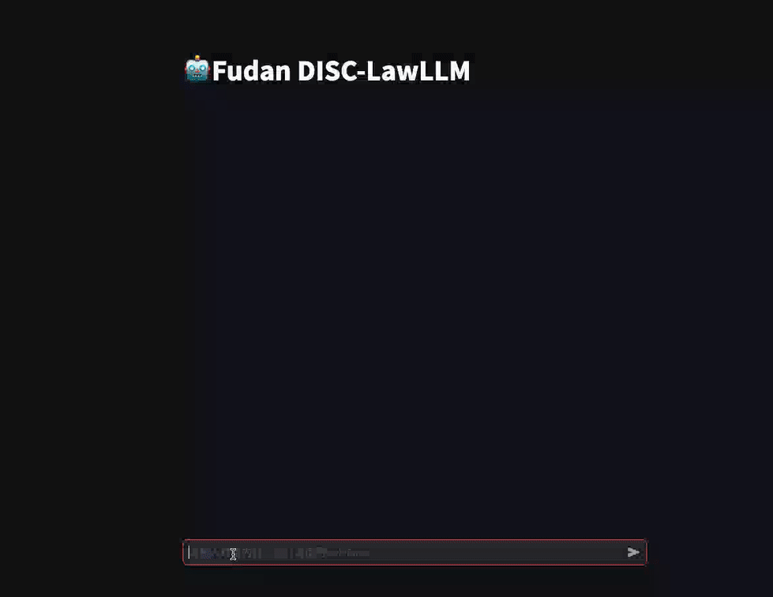

<div align="center">

ZH | [EN](./README-en.md)

<h1>DISC-LawLLM</h1>
  
[](https://huggingface.co/ShengbinYue/DISC-LawLLM)
[](./LICENSE)

[Demo](http://law.fudan-disc.com) | [技术报告](https://arxiv.org/abs/2309.11325) | [论文](https://link.springer.com/chapter/10.1007/978-981-97-5569-1_19)

</div>

DISC-LawLLM 是一个旨在为用户提供专业、智能、全面的**法律服务**的法律领域大模型，由[复旦大学数据智能与社会计算实验室 (Fudan-DISC)](http://fudan-disc.com) 开发并开源。

我们将在该项目中开源如下资源：
* [DISC-Law-SFT 数据集](https://huggingface.co/datasets/ShengbinYue/DISC-Law-SFT)
* [DISC-LawLLM-7B 模型权重](https://huggingface.co/ShengbinYue/LawLLM-7B) 
* [DISC-LawLLM-13B 模型权重](https://huggingface.co/ShengbinYue/DISC-LawLLM) 
* [DISC-Law-Eval Benchmark](./eval/)

您可以通过访问这个[链接](https://law.fudan-disc.com)来在线体验我们的 DISC-LawLLM。

## 新闻
**[2025/05/20]** 🎉 由于新版transformer不支持Baichun，我们在8卡A100上全量微调了基于Qwen2.5-instruct 7B的 [**LawLLM-7B**](https://huggingface.co/ShengbinYue/LawLLM-7B)

**[2024/10/15]** 🎉 我们开源了DISC-Law-SFT 数据集中的[法律问答部分](https://huggingface.co/datasets/ShengbinYue/DISC-Law-SFT)（DISC-Law-SFT-Pair-QA-released.jsonl和DISC-Law-SFT-Triplet-QA-released.jsonl）

**[2024/03/15]** 🎉🥳✨我们的论文 “[LawLLM: Intelligent Legal System with Legal Reasoning and Verifiable Retrieval](https://link.springer.com/chapter/10.1007/978-981-97-5569-1_19)” 被 DASFAA 2024 (**CCF-B**) 的 Research Track 录用为长文.✨

**[2023/12/20]** 🎉 我们在最新的法律评测Benchmark [Lawbench](https://github.com/open-compass/LawBench) 上的评测了DISC-LawLLM，[结果](#模型在lawbench上的测试结果)仅次于**GPT-4**，超出了**GPT3.5**和目前所有的法律大模型。

**[2023/11/20]** 🎉 我们开源了 DISC-Law-Eval Benchmark 的评测代码，更多详情请在[此处](./eval/README.md)查看。

**[2023/10/19]** 我们开源了 DISC-Law-Eval Benchmark 中的[评测数据集](./eval/datasets/)（包括标准答案）。

**[2023/09/26]** DISC-LawLLM v1.0 已正式发布，开源 [DISC-LawLLM-13B 模型](https://huggingface.co/ShengbinYue/DISC-LawLLM) 和 [DISC-Law-SFT 数据集](https://huggingface.co/datasets/ShengbinYue/DISC-Law-SFT)。

## 目录

- [概述](#概述)
- [推理和部署](#推理和部署)
- [模型微调](#模型微调)
- [DISC-Law-Eval Benchmark](#disc-law-eval-benchmark)
- [致谢](#致谢)
- [声明](#声明)
- [引用](#引用)
- [协议](#协议)

## 概述


<p></p>

DISC-LawLLM 是一个具有法律推理和知识检索能力的智能法律系统，它面向不同群体，能在不同应用场景下提供帮助，主要有以下几个特点：

* **法律文本处理能力：** 针对法律语言的理解与生成能力，包括信息抽取、文本摘要等，我们基于现有的 NLP 司法任务公开数据和真实世界的法律相关文本进行了微调数据的构建。
* **法律推理思维能力：** 针对智慧司法领域任务的需求，我们使用法律三段论这一法理推理理论设计了指令数据，有效地提高了模型的法理推理能力。
* **司法领域知识遵循能力：** 我们为智能法律处理系统配备了检索增强的模块，增强了系统对于背景知识的的检索和遵循能力。

除此之外，我们的研究过程还包括了如下贡献：

* **高质量的训练数据集和普遍有效的训练范式**
* **完备的法律模型测评框架和测评数据集**


### 模型在Lawbench上的测试结果
DISC-LawLLM在[Lawbench](https://github.com/open-compass/LawBench)上的评测结果仅次于GPT-4，超出了目前所有的法律大模型。以下是DISC-LawLLM和其他模型在Lawbench上Zero-shot、One-shot的平均分数排序：
#### Zero-shot 性能

#### One-shot 性能


### 模型效果演示

#### 法律咨询


#### 协议撰写



#### 司法专业工具


#### 考试助手


#### 法条检索


#### 带检索的法律咨询


### DISC-Law-SFT 数据集

不同场景下的法律智能应用通常需要结合法律文本理解和生成的多种基本能力。为此，我们构建了一个高质量的监督微调数据集 DISC-Law-SFT，包括法律信息提取、判决预测、文档摘要和法律问题解答，确保覆盖不同司法应用场景。DISC-Law-SFT 包括两个子集，即 DISC-Law-SFT-Pair 和 DISC-Law-SFT-Triplet。前者旨在为 LLM 引入法律推理能力，后者则有助于提高模型利用外部知识的能力，具体的构建细节请参照我们的[技术报告](https://arxiv.org/abs/2309.11325)。数据集的分布如下所示：


<table>
  <tr>
    <th>数据集</th>
    <th>对应任务/来源</th>
    <th>样本量</th>
    <th>对应情境</th>
  </tr>
  <tr>
    <td rowspan="10">DISC-Law-SFT-Pair</td>
    <td>司法要素提取</td>
    <td>32K</td>
    <td rowspan="7">法律专业人员助手</td>
  </tr>
  <tr>
    <td>司法事件检测</td>
    <td>27K</td>
  </tr>
  <tr>
    <td>案件分类</td>
    <td>20K</td>
  </tr>
  <tr>
    <td>判决预测</td>
    <td>11K</td>
  </tr>
  <tr>
    <td>类案匹配</td>
    <td>8K</td>
  </tr>
  <tr>
    <td>司法摘要</td>
    <td>9K</td>
  </tr>
  <tr>
    <td>舆情摘要</td>
    <td>6K</td>
  </tr>
  <tr>
    <td>法律问答</td>
    <td>93K</td>
    <td>法律咨询服务</td>
  </tr>
  <tr>
    <td>司法阅读理解</td>
    <td>38K</td>
    <td rowspan="2">法律考试助手</td>
  </tr>
  <tr>
    <td>法律考试</td>
    <td>12K</td>
  </tr>
  <tr>
    <td rowspan="2">DISC-Law-SFT-Triplet</td>
    <td>判决预测</td>
    <td>16K</td>
    <td>法律专业人员助手</td>
  </tr>
  <tr>
    <td>法律问答</td>
    <td>23K</td>
    <td>法律咨询服务</td>
  </tr>
  <tr>
    <td rowspan="2">General</td>
    <td>Alpaca-GPT4</td>
    <td>48K</td>
    <td rowspan="2">通用场景</td>
  </tr>
  <tr>
    <td>Firefly</td>
    <td>60K</td>
  </tr>
  <tr>
    <td>总计</td>
    <td colspan="3">403K</td>
  </tr>
</table>

我们总共发布了近30万条训练数据，其中包括 DISC-Law-SFT-Pair 和 DISC-Law-SFT-Triplet。您可以访问这个[链接](https://huggingface.co/datasets/ShengbinYue/DISC-Law-SFT)下载数据集。

### 检索增强模块

我们在 DISC-LawLLM 的基础上增加了一个基于开源检索框架 [Langchain-Chatchat](https://github.com/chatchat-space/Langchain-Chatchat) 的检索模块。我们的知识库目前包括法条库和法考题库。

* 法条库包含 800 多部国家地方法律、条例和规定，其中包括《宪法》、《刑法》、《行政诉讼法》、《保险法》、《劳动法》、《著作权法》、《民法典》、《专利法》、《专属经济区和大陆架法》、《中国人民解放军选举全国人民代表大会和县级以上地方各级人民代表大会代表的办法》、《反分裂国家法》、《出境入境边防检查条例》、《国务院关于鼓励台湾同胞投资的规定》、《境内外国人宗教活动管理规定》等。
* 法考题库包含 2.4 万道法律相关的考试题目。

在未来，我们会增加更加丰富的知识库。我们还将进一步深入探索检索增强的 DISC-LawLLM，包括但不限于检索器与 LLM 的联合训练机制，各位有兴趣可以与我们一起交流。

## 推理和部署
### DISC-LawLLM 13B
开源版本的 DISC-LawLLM 是基于 [Baichuan-13B-Base](https://github.com/baichuan-inc/Baichuan-13B) 进行微调训练得到的。您可以直接从 [Hugging Face](https://huggingface.co/ShengbinYue/DISC-LawLLM) 上下载我们的模型权重，或者根据下面的代码样例自动获取。推理前请安装依赖：
⚠️注意transformer版本使用**4.29.1**
```
pip install -r requirements.txt
```

### Python

```python
import torch
from transformers import AutoModelForCausalLM, AutoTokenizer
from transformers.generation.utils import GenerationConfig

model_path = "ShengbinYue/DISC-LawLLM"
model = AutoModelForCausalLM.from_pretrained(
    model_path, torch_dtype=torch.float16, device_map="auto", trust_remote_code=True
)
model.generation_config = GenerationConfig.from_pretrained(model_path)
tokenizer = AutoTokenizer.from_pretrained(
    model_path, use_fast=False, trust_remote_code=True,
)

messages = [
    {"role": "user", "content": "生产销售假冒伪劣商品罪如何判刑？"},
]
response = model.chat(tokenizer, messages)
```

#### 命令行工具

```
python cli_demo.py
```

#### 网页 Demo

依靠 streamlit 工具运行以下命令，会在本地启动一个 web 服务，把控制台给出的地址输入浏览器即可访问：

```
streamlit run web_demo.py --server.port 8888
```

此外，目前版本的 DISC-LawLLM 是以 Baichuan-13B 作为基座的，您可以参照 [Baichuan-13B](https://github.com/baichuan-inc/Baichuan-13B) 的介绍来进行 int8 或 int4 量化推理部署以及 CPU 部署。

### DISC-LawLLM-7B
由于DISC-LawLLM-13B模型基于baichuan基座训练，对新版本transformer和vllm不友好，我们推出了基于Qwen2.5-instruct 7B全量微调的 **LawLLM-7B**，其推理速度更快，方便开发人员使用。
在这里我们提供基于VLLM的推理方法，详细可以参考[huggface页面](https://huggingface.co/ShengbinYue/LawLLM-Qwen2.5-7B)。
```
pip install vllm
```
推理代码如下
```python
from transformers import AutoModelForCausalLM, AutoTokenizer
from vllm import LLM, SamplingParams

model_name ='ShengbinYue/LawLLM-7B'

sampling_params = SamplingParams(
    temperature=0.1,
    top_p=0.9,
    top_k=50,
    max_tokens=4096
)
llm = LLM(model=model_name)

tokenizer = AutoTokenizer.from_pretrained(model_name)
prompt =  "生产销售假冒伪劣商品罪如何判刑？"

# prompt = "戴罪立功是什么意思"
messages = [
    {"role": "system", "content": "你是LawLLM，一个由复旦大学DISC实验室创造的法律助手。"},
    {"role": "user", "content": prompt}
]
text = tokenizer.apply_chat_template(
    messages,
    tokenize=False,
    add_generation_prompt=True
)

outputs = llm.generate([text], sampling_params)
for output in outputs:
    prompt = output.prompt
    generated_text = output.outputs[0].text
    print(f"Prompt: {prompt!r}, Generated text: {generated_text!r}")
```


## 模型微调

开发者可以对 DISC-LawLLM 13B或7B 进行微调使用。在此可以参照与 DISC-LawLLM 兼容的微调工具 [LLaMA Factory](https://github.com/hiyouga/LLaMA-Factory)。

- 首先，下载[LLaMA Factory](https://github.com/hiyouga/LLaMA-Factory)。
- 按其要求[安装依赖](https://github.com/hiyouga/LLaMA-Factory?tab=readme-ov-file#getting-started)。
- 按照要求，将数据处理成对应格式，参考[Data](https://github.com/hiyouga/LLaMA-Factory/tree/main/data)。
- 开始训练

我们给出**全量**和 **LoRA** 两种微调示例。
### 全量微调

我们在 8 * Nvidia A800 80 GB + deepspeed 的环境下进行了全量微调测试。使用 [lawllm_full_sft.yaml]()，训练启动脚本示例如下：

```
llamafactory-cli train lawllm_full_sft.yaml
```


### LoRA 微调

我们在 4 * Nvidia A800 80G 显卡上进行了 LoRA 微调测试。使用 [lawllm_lora_sft.yaml]()，训练启动脚本示例如下：

```
llamafactory-cli train lawllm_lora_sft.yaml
```
使用 [lawllm_merge_lora.yaml]()，lora 合并脚本如下：
```
llamafactory-cli export lawllm_merge_lora.yaml
```

## DISC-Law-Eval-Benchmark

受司法考试构成的启发，我们开发了一个公平的评估框架 —— DISC-Law-Eval Benchmark，从客观和主观两个角度对法律大语言模型的性能进行评估，以考察模型在中国法律领域的性能。您可以点击在[这里](./eval/README.md)查看 DISC-Law-Eval Benchmark 的更多详情。我们还开发了名为 [ml3m](https://github.com/Charlie-XIAO/ml3m) 的 Python 套件，取自 **M**ultilevel **L**egal **LLM**。您可以在[这里](https://charlie-xiao.github.io/)查看其技术文档。

### 客观评测

为了客观、定量地评估智能法律系统的法律知识和推理能力，客观的评价数据集由一系列中国法律标准化考试和知识竞赛的单项和多项选择题组成，并根据内容复杂性和演绎难度，将问题分为困难、中等和简单三个层次。它可以提供一个更具挑战性和可靠的方法来衡量模型是否可以利用其知识来推理正确的答案。我们通过一系列[正则表达式](./eval/src/eval.py#L5)来匹配模型回复中所选择的选项，并将其与标准答案比对，最终通过计算模型回答争取的题目的百分比来衡量模型的客观题答题性能。你可以在[这里](./eval/datasets/objective/)查看我们的客观评测集。数据集具体构成如下：

<table>
  <tr>
    <th>科目</th>
    <th>难度等级</th>
    <th>单选题数量</th>
    <th>多选题数量</th>
    <th>总数</th>
  </tr>
  <tr>
    <td>NJE：国家统一法律职业资格考试</td>
    <td rowspan="3">困难</td>
    <td>537</td>
    <td>463</td>
    <td>1000</td>
  </tr>
  <tr>
    <td>PAE：专利代理人考试</td>
    <td>118</td>
    <td>276</td>
    <td>394</td>
  </tr>
  <tr>
    <td>CPA：注册会计师资格考试</td>
    <td>197</td>
    <td>120</td>
    <td>317</td>
  </tr>
  <tr>
    <td>UNGEE：法学专硕全国统考试题</td>
    <td>中等</td>
    <td>320</td>
    <td>87</td>
    <td>407</td>
  </tr>
  <tr>
    <td>LBK：法律基础知识题库</td>
    <td rowspan="2">简单</td>
    <td>275</td>
    <td>-</td>
    <td>275</td>
  </tr>
  <tr>
    <td>PFE：事业编、公务员考试法律试题</td>
    <td>170</td>
    <td>-</td>
    <td>170</td>
  </tr>
</table>

### 主观评测

在主观评测部分，我们采用问答题形式进行评估，模拟主观考试问题的过程。我们从法律咨询、在线论坛、与司法相关的出版物和法律文件中手工构建了一个高质量的测试集。我们用 GPT-3.5 Turbo 作为裁判模型来评估模型的输出，并基于标准答案用准确性、完整性和清晰度这三个标准提供 1-5 的评分。详见 [ml3m 文档](https://charlie-xiao.github.io/ml3m/modules/ml3m.qa.html#ml3m.qa.QaOpenAIEvaluator)。

主观题数据集从来源于法律咨询、网上发帖、司法相关出版物和法律文书中手动构建的一个高质量的测试集，其中包括 300 个示例，涵盖了法律知识问答、法律咨询和判决预测等场景。你可以在[这里](./eval/datasets/subjective/)查看我们的主观评测集。

### 评测结果

客观题评测采用 few-shot 方式，结果（%）如下：

|        模型        |  NJE 单选   |  NJE 多选   |  PAE 单选   |  PAE 多选   |  CPA 单选   |  CPA 多选   | UNGEE 单选  | UNGEE 多选  |  PFE 单选   |  LBK 单选   |   平均   |
|:----------------:|:---------:|:---------:|:---------:|:---------:|:---------:|:---------:|:---------:|:---------:|:---------:|:---------:|:---------:|
|     ChatGLM      |   31.66   |   1.08    |   27.97   |   2.90    |   37.06   |   13.33   |   39.69   |   20.69   |   37.65   |   42.91   |   24.66   |
|  Baichuan-Chat   |   31.47   |   10.15   |   29.66   |   8.70    |   35.53   |   19.17   |   50.00   |   27.59   |   53.12   |   53.45   |   30.78   |
| Chinese-Alpaca-2 |   25.70   |   10.15   |   30.51   |   11.59   |   32.99   |   19.17   |   40.94   |   21.84   |   44.12   |   43.27   |   26.73   |
|  GPT-3.5-turbo   |   36.50   |   10.58   |   37.29   |   17.03   | **42.13** | **21.67** | **51.25** | **28.74** |   53.53   |   54.18   |   34.10   |
|     LexiLaw      |   20.11   |   7.56    |   23.73   |   10.14   |   24.87   |   19.17   |   31.56   |   16.09   |   31.76   |   40.36   |   21.50   |
|      LawGPT      |   22.91   |   6.26    |   31.36   |   7.61    |   25.38   |   16.67   |   30.31   |   13.79   |   34.71   |   29.09   |   20.60   |
|   Lawyer LLaMa   |   35.75   |   5.62    |   32.20   |   6.52    |   29.95   |   13.33   |   32.50   |   14.94   |   39.41   |   39.64   |   25.05   |
|     ChatLaw      |   27.56   |   7.99    |   31.36   |   9.42    |   35.53   |   11.67   |   35.62   |   17.24   |   42.35   |   41.09   |   25.20   |
|   DISC-LawLLM    | **42.09** | **19.87** | **40.68** | **18.48** |   39.59   |   19.17   |   50.94   |   25.29   | **57.06** | **54.91** | **37.10** |

主观题评测分数为 1-5，结果如下：

|        模型        | 准确性  | 完整性  | 清晰性  |  平均  |
|:----------------:|:----:|:----:|:----:|:----:|
|     ChatGLM      | 2.64 | 2.75 | 3.23 | 2.87 |
|  Baichuan-Chat   | 3.22 | **3.34** | 3.18 | 3.25 |
| Chinese-Alpaca-2 | 3.13 | 3.23 | 3.17 | 3.17 |
|     LexiLaw      | 3.06 | 2.62 | 3.00 | 2.90 |
|      LawGPT      | 3.02 | 2.58 | 2.96 | 2.86 |
|   Lawyer LLaMa   | 3.13 | 2.83 | 3.35 | 3.10 |
|     ChatLaw      | 3.31 | 2.90 | 3.35 | 3.19 |
|   DISC-LawLLM    | **3.46** | 3.12 | **3.59** | **3.39** |

## 致谢

本项目基于如下开源项目展开，在此对相关项目和开发人员表示诚挚的感谢：

- [**Baichuan-13B**](https://github.com/baichuan-inc/Baichuan-13B)
- [**Langchain-Chatchat**](https://github.com/chatchat-space/Langchain-Chatchat)
- [**LLaMA Efficient Tuning**](https://github.com/hiyouga/LLaMA-Efficient-Tuning)
- [**FireFly**](https://github.com/yangjianxin1/Firefly)

同样感谢其他限于篇幅未能列举的为本项目提供了重要帮助的工作。

## 声明

DISC-LawLLM 有着目前大语言模型尚无法克服的问题和缺陷，尽管它能够在许多任务和情境上提供法律服务，但模型应当仅供用户参考使用，并不能替代专业律师和法律专家，我们希望 DISC-LawLLM 的用户以批判性的眼光去评估模型。我们不对因使用 DISC-LawLLM 所引发的任何问题、风险或不良后果承担责任。

## 引用

如果我们的项目对您的研究和工作有帮助，请如下引用我们的项目：

```
@misc{yue2023disclawllm,
    title={DISC-LawLLM: Fine-tuning Large Language Models for Intelligent Legal Services}, 
    author={Shengbin Yue and Wei Chen and Siyuan Wang and Bingxuan Li and Chenchen Shen and Shujun Liu and Yuxuan Zhou and Yao Xiao and Song Yun and Xuanjing Huang and Zhongyu Wei},
    year={2023},
    eprint={2309.11325},
    archivePrefix={arXiv},
    primaryClass={cs.CL}
}

@inproceedings{yue2024lawllm,
  title={LawLLM: Intelligent Legal System with Legal Reasoning and Verifiable Retrieval},
  author={Yue, Shengbin and Liu, Shujun and Zhou, Yuxuan and Shen, Chenchen and Wang, Siyuan and Xiao, Yao and Li, Bingxuan and Song, Yun and Shen, Xiaoyu and Chen, Wei and others},
  booktitle={International Conference on Database Systems for Advanced Applications},
  pages={304--321},
  year={2024},
  organization={Springer}
}
```

## 协议

DISC-LawLLM 可在 Apache 许可证下使用。请查看 [LICENSE](./LICENSE) 文件获取更多信息。

## Star History

<picture>
    <source media="(prefers-color-scheme: dark)" srcset="https://api.star-history.com/svg?repos=FudanDISC/DISC-LawLLM&type=Date&theme=dark" />
    <source media="(prefers-color-scheme: light)" srcset="https://api.star-history.com/svg?repos=FudanDISC/DISC-LawLLM&type=Date" />
    
</picture>
